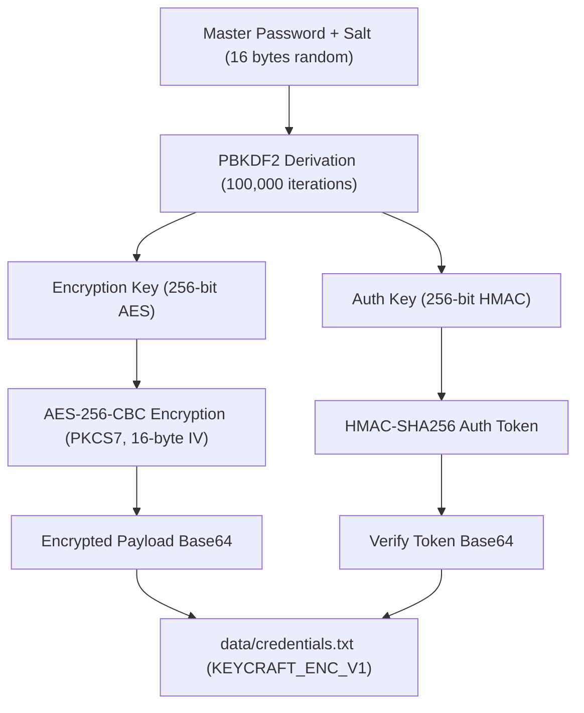
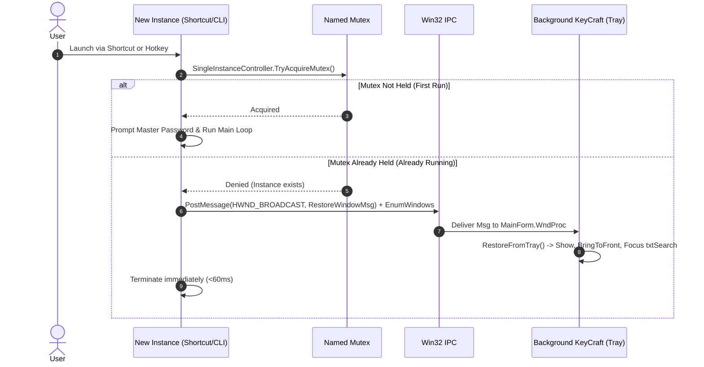
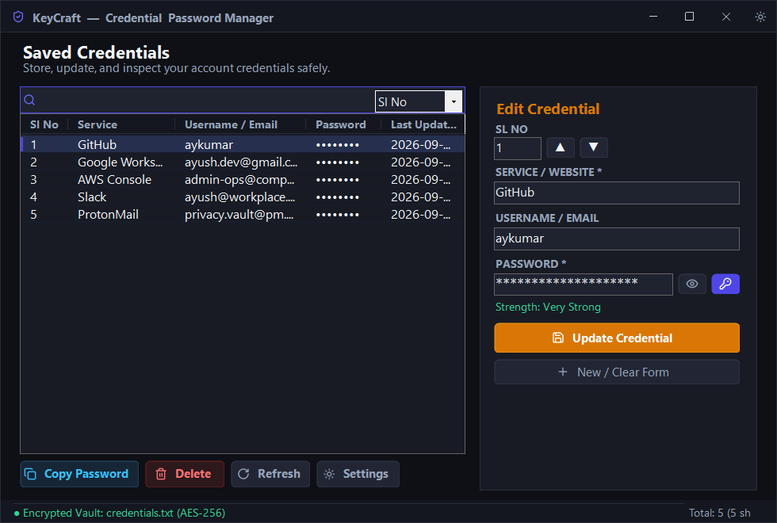
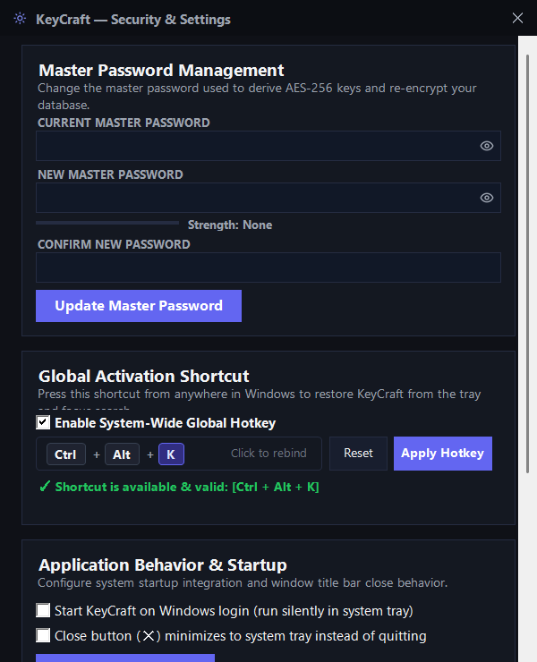

# KeyCraft — Local Secure Windows Credential Manager

[](https://microsoft.com)
[](https://dotnet.microsoft.com)
[](https://en.wikipedia.org/wiki/Advanced_Encryption_Standard)
[](https://en.wikipedia.org/wiki/PBKDF2)
[](https://en.wikipedia.org/wiki/HMAC)

**KeyCraft** is a standalone, high-performance, offline-first Windows password manager built from the ground up in C# with Win32 APIs. It features zero external dependencies, native single-instance background lifecycle management, system tray minimization, debounced keyboard accelerators, and military-grade AES-256 encryption.

---

## Table of Contents
1. [Core Features](#core-features)
2. [Security & Cryptographic Architecture](#security--cryptographic-architecture)
3. [Process Lifecycle & Single-Instance IPC](#process-lifecycle--single-instance-ipc)
4. [Keyboard Navigation & Debounce Logic](#keyboard-navigation--debounce-logic)
5. [User Interface & Design Aesthetics](#user-interface--design-aesthetics)
6. [Command Line Interface (CLI)](#command-line-interface-cli)
7. [Compilation & Installation](#compilation--installation)
8. [File Structure](#file-structure)
9. [Automated Test Suite](#automated-test-suite)

---

## Core Features

- **Zero-Dependency Native Windows Executable**: Compiles with standard Windows `csc.exe` (`.NET Framework 4.0+`). Requires no external installers, runtimes, or third-party DLLs.
- **Military-Grade Vault Security**: Encrypted database (`KEYCRAFT_ENC_V1`) using AES-256-CBC, PBKDF2 key derivation with 100,000 iterations, and HMAC-SHA256 integrity verification with constant-time equality checks.
- **Single-Instance Background Process**: Runs continuously in the background once unlocked. Any subsequent launches detect the existing instance and signal it to restore, bring to front, and focus without re-prompting for the master password.
- **System Tray Minimization (`NotifyIcon`)**: Double-pressing <kbd>Escape</kbd> or clicking the title bar minimize button hides the window from both the screen and taskbar, living quietly in the system notification area.
- **Hardware-Debounced Double <kbd>Escape</kbd>**: High-precision debouncing engine (`DoublePressDebouncer`) ignores mechanical switch bounce (<60ms) and detects consecutive double-presses within 0.5s to minimize to tray.
- **Instant Search & Real-Time Filtering**: Column-specific filtering by Serial Number (`Sl No`), `Service`, or `Username`. Default search prioritizes Serial Number with auto-selection of the top item.
- **Interactive Serial Number Remapping**: Arbitrary numeric remapping of credentials with instant table re-ordering and persistent disk synchronization.
- **Custom Frameless Obsidian UI**: Dark theme (`#0E1015` window, `#14171F` title bar, `#1F2330` inputs, `#4F46E5` primary indigo accents), custom title bar with pixel-perfect native buttons, and edge border resizing across all sides and corners.
- **Password Generator & Strength Meter**: Entropy calculation with real-time visual progress bar and cryptographically strong password generator.

---

## Security & Cryptographic Architecture

KeyCraft uses an offline, zero-knowledge security model. Your passwords never touch the network, cloud, or Windows registry.



### 1. Key Derivation (`PBKDF2`)
- **Algorithm**: `Rfc2898DeriveBytes` (HMAC-SHA1).
- **Salt**: 16 bytes of cryptographically secure random bytes generated via `RNGCryptoServiceProvider`.
- **Iteration Count**: 100,000 iterations to protect against GPU-based offline dictionary attacks.
- **Key Split**: Derives 64 bytes of pseudo-random data:
  - First 32 bytes: `AES-256` Encryption Key.
  - Second 32 bytes: `HMAC-SHA256` Authentication Key.

### 2. Vault Encryption (`AES-256-CBC`)
- **Cipher**: AES (RijndaelManaged) in Cipher Block Chaining (CBC) mode with PKCS7 padding.
- **Initialization Vector (IV)**: Fresh, random 16-byte IV generated for every encryption pass.
- **Database Format (`KEYCRAFT_ENC_V1`)**:
  ```text
  KEYCRAFT_ENC_V1
  Salt:<Base64 16-byte salt>
  IV:<Base64 16-byte IV>
  Verify:<Base64 32-byte HMAC-SHA256 authentication token>
  Payload:<Base64 AES-256-CBC ciphertext of tab-delimited credentials>
  ```

### 3. Tamper Detection & Side-Channel Mitigation
- **Constant-Time Verification**: Verification tokens are compared using XOR byte-by-byte comparisons in `VaultSecurity.ConstantTimeEquals`, eliminating timing attack vulnerabilities.
- **Volatile In-Memory Session**: Decrypted session keys (`sessionEncKey`, `sessionAuthKey`) exist exclusively in application RAM and are securely wiped (`Array.Clear`) when the vault is locked or the application terminates.

---

## Process Lifecycle & Single-Instance IPC

KeyCraft is engineered as a background daemon that stays resident in memory once authenticated.



### IPC Technical Details
1. **Named Mutex**: `Local\KeyCraftPasswordManager_SingleInstance_Mutex`.
2. **Registered Windows Message**: `RegisterWindowMessage("KeyCraft_RestoreWindow_Message_V1")`.
3. **UIPI Bypass**: `NativeMethods.ChangeWindowMessageFilter(msgId, MSGFLT_ADD)` allows messages to pass freely across user privilege boundaries.
4. **Dual Window Discovery**:
   - `PostMessage(HWND_BROADCAST, msgId, ...)` broadcasts to all top-level windows.
   - `EnumWindows` scans all windows belonging to the existing process ID, ensuring instantaneous restore even when the window was completely hidden (`Visible = false`) in the system tray.

---

## Keyboard Navigation & Debounce Logic

KeyCraft provides a rich, keyboard-first navigation model managed by `KeyboardShortcutManager`:

| Shortcut | Scope | Description |
|:---|:---|:---|
| **Double <kbd>Escape</kbd>** | Global Window | Minimizes KeyCraft to System Tray (within 0.5s, debounced) |
| **Single <kbd>Escape</kbd>** | Global Window | Clears search box text or reverts editor fields |
| **<kbd>Ctrl + F</kbd>** | Global Window | Focuses search box and selects all text |
| **<kbd>Ctrl + C</kbd>** | List / Search | Copies password of selected credential to clipboard |
| **<kbd>Ctrl + S</kbd>** | Global Window | Saves or updates active credential |
| **<kbd>Ctrl + N</kbd>** | Global Window | Clears editor fields and focuses `Service` for new entry |
| **<kbd>Ctrl + P</kbd>** / <kbd>Space</kbd> | Editor / List | Toggles password visibility (Eye / EyeOff) |
| **<kbd>Ctrl + G</kbd>** | Global Window | Generates a new cryptographically random password |
| **<kbd>Alt + Up</kbd>** | Global Window | Moves selected credential up (remapping order) |
| **<kbd>Alt + Down</kbd>** | Global Window | Moves selected credential down (remapping order) |
| **<kbd>F5</kbd>** | Global Window | Reloads credentials from disk |
| **<kbd>Delete</kbd>** | Credential List | Prompts to delete selected credential |
| **<kbd>Enter</kbd>** | List / Search | Switches directly into editor mode for selected item |
| **<kbd>Down Arrow</kbd>** | Search Box | Moves focus from search box down to credential list |
| **<kbd>Up Arrow</kbd>** | Credential List | Returns focus from top list item back to search box |

### Debouncing Architecture (`DoublePressDebouncer`)
- **Debounce Interval (< 60ms)**: Any consecutive Escape press received within 60ms is discarded as mechanical switch jitter or typematic repeat.
- **Double Tap Window (60ms – 500ms)**: Consecutive presses within this interval fire `DoubleEscapeTriggered` to minimize to tray.
- **Separated Press (> 500ms)**: Treated as independent single Escape commands.

---

## User Interface & Design Aesthetics

- **Obsidian Palette**:
  - Main Background: `#0E1015`
  - Cards & Sidebars: `#181B24`
  - Input Boxes: `#1F2330`
  - Borders: `#282D3C`
  - Primary Accent: `#4F46E5` (Indigo)
  - Copy Accent: `#38BDF8` (Cyan)
  - Danger Accent: `#F87171` (Crimson)
- **Title Bar**: Native-feeling frameless title bar with pixel-perfect Minimize, Maximize/Restore, and Close buttons. Includes edge-resizing support across all 4 borders and 4 corners via `WM_NCHITTEST` and `EdgeResizeFilter`.
- **System Tray Notification Area**:
  - Sleek indigo shield icon in Windows notification area.
  - Balloon notification on initial minimization.
  - Tray Context Menu: *Open KeyCraft*, *Search Credentials*, *Lock Vault*, *Settings...*, *Exit*.

---

## Command Line Interface (CLI)

KeyCraft supports command line flags for automation, testing, and Windows startup scripts:

| Argument | Description |
|:---|:---|
| `-p <password>` / `--password <password>` | Unlocks vault headlessly with the provided master password. |
| `--tray` / `--min` | Launches directly minimized to the Windows system tray. |
| `--max` / `--maximize` | Forces window to open in maximized state when signaling existing instance. |

### Examples
```powershell
# Launch KeyCraft silently minimized to tray on Windows startup
bin\PasswordManager.exe -p "YourMasterPassword" --tray

# Wake up background instance from a script or custom launcher
bin\PasswordManager.exe

# Wake up and maximize to full screen
bin\PasswordManager.exe --max
```

---

## Compilation & Installation

### Prerequisites
- Windows 10, 11, or Windows Server.
- .NET Framework 4.0 or newer (pre-installed on all modern Windows versions).
- Standard Microsoft C# Compiler (`csc.exe`).

### Build Instructions
Run PowerShell from the repository root:

```powershell
# 1. Terminate any running instance
Get-Process -Name "PasswordManager" -ErrorAction SilentlyContinue | Stop-Process -Force

# 2. Compile using native Framework csc.exe
& "C:\Windows\Microsoft.NET\Framework64\v4.0.30319\csc.exe" `
    /nologo `
    /target:winexe `
    /out:"bin\PasswordManager.exe" `
    /reference:System.dll,System.Drawing.dll,System.Windows.Forms.dll,System.Core.dll `
    *.cs
```

Or execute the provided batch script:
```cmd
scripts\build_and_run.bat
```

---

## Screenshots

<p align="center">
  
  <br />
  <em>Main Obsidian GUI — Serial Number Indexing, Real-Time Search & Quick Credential Editor</em>
</p>

<p align="center">
  
  <br />
  <em>Settings & Security Panel — Master Password Rotation, PowerToys-Style Interactive Hotkey Selector, & Startup Preferences</em>
</p>

---

## File Structure

```text
windows-password-manager/
├── assets/
│   ├── icons/                    # High-DPI procedural vector iconography (.png / .svg)
│   └── screenshots/              # Application screenshots and visual previews
├── bin/                          # Compiled binaries (ignored by Git)
├── data/                         # Encrypted vault & local settings (ignored by Git)
├── scripts/
│   ├── build_and_run.bat         # Windows CMD build & run launcher
│   ├── build_and_run.ps1         # PowerShell build & run script
│   ├── capture_form.ps1          # Form screenshot utility
│   ├── capture_window.py         # Window snapshot utility
│   ├── fetch_icons.py            # Lucide icon asset fetcher
│   ├── run_tests.bat             # Batch launcher for automated test suites
│   └── run_tests.ps1             # PowerShell automated test runner (Tier 1 & Tier 2)
├── tests/
│   ├── TestRunner_Tier1.cs       # Tier 1: Programmatic engine & cryptographic test suite (12 tests)
│   └── TestRunner_Tier2.cs       # Tier 2: End-to-end UI & system automation test suite (8 flows)
├── AppSettings.cs                # Configuration persistence, Windows startup registry, & preferences
├── Credential.cs                 # Domain model (Id, SlNo, Service, Username, Password, LastUpdated)
├── CredentialRepository.cs       # File I/O, parsing, and vault read/write
├── CredentialService.cs          # Business logic, reordering, searching, CRUD operations
├── GlobalHotkeyManager.cs        # Win32 RegisterHotKey, conflict detection, & WM_HOTKEY dispatch
├── HotkeyPickerControl.cs        # Microsoft PowerToys-style interactive key capture control
├── IconResources.cs              # High-DPI procedural vector iconography cache
├── KeyboardShortcutManager.cs    # Debounced double-escape & shortcut router
├── MainForm.cs                   # Main Obsidian GUI, system tray, & event wiring
├── MasterPasswordForm.cs         # Master password creation & unlock dialog
├── NativeMethods.cs              # Win32 API declarations (IPC, messages, window control)
├── Program.cs                    # Entry point, Mutex single-instance check, & CLI args
├── SafeFileStorage.cs            # Atomic writing, disk flush (fs.Flush(true)), & .bak rotation
├── SettingsForm.cs               # Dedicated Security & Settings panel with live hotkey selector
├── SingleInstanceController.cs   # System-wide Mutex & window messaging IPC
├── VaultSecurity.cs              # AES-256, PBKDF2 (100k), HMAC-SHA256 cryptographic core
└── README.md                     # Master documentation
```

---

## Automated Test Suite

KeyCraft includes an extensive **20-test multi-tier automated test suite**:

### Tier 1: Programmatic & Functional Engine Suite (`tests/TestRunner_Tier1.cs`)
Validates core cryptographic operations, domain models, services, debouncing algorithms, and Win32 helpers in isolation:
- **TC-01**: `SafeFileStorage` Atomic Write, Buffer Flushing & Rotating Backup
- **TC-02**: PBKDF2 Key Derivation (100,000 Iterations & Deterministic Separation)
- **TC-03**: AES-256-CBC Encryption & Decryption Roundtrip
- **TC-04**: HMAC-SHA256 Tamper Detection & Constant-Time Integrity Verification
- **TC-05**: Zero-Knowledge RAM Scrubbing (`VaultSecurity.LockSession` in-memory zeroing)
- **TC-06**: Credential Model & Escape/Unescape Serialization
- **TC-07**: `CredentialService` Arbitrary Reordering & Serial Number Shift Remapping
- **TC-08**: `CredentialService` Column-Specific Search Filtering
- **TC-09**: `DoublePressDebouncer` High-Precision Stopwatch Timing & Switch Jitter Filter
- **TC-10**: Single-Instance Mutex Enforcement
- **TC-11**: Global Hotkey Formatting & Win32 Availability Verification
- **TC-12**: `AppSettings` Configuration Persistence

### Tier 2: End-to-End UI & System Automation Suite (`tests/TestRunner_Tier2.cs`)
Controls the application from clean data wipe through the full user lifecycle:
- **FLOW 1**: Clean Data Wipe & Master Password Creation UI
- **FLOW 2**: Vault Lock & Master Password Unlock UI
- **FLOW 3**: Credential Management CRUD, Remapping & Password Generator
- **FLOW 4**: Real-Time Search Filtering & Quick Navigation
- **FLOW 5**: Clipboard Password Copy & Toast Notification
- **FLOW 6**: Debounced Double-Escape Minimize to System Tray
- **FLOW 7**: Single-Instance IPC Wake-Up from Tray to Foreground
- **FLOW 8**: Settings Panel, PowerToys Hotkey Rebinding & Close-to-Tray Preferences

### Running the Test Suite
Execute the test runner script from PowerShell or Command Prompt:
```cmd
scripts\run_tests.bat
```
Or via PowerShell:
```powershell
powershell -ExecutionPolicy Bypass -File scripts\run_tests.ps1
```
